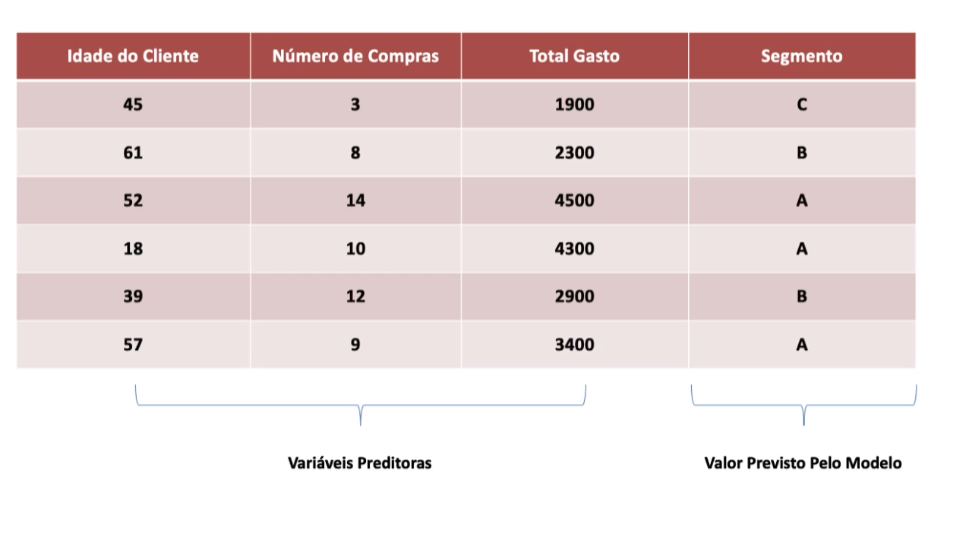
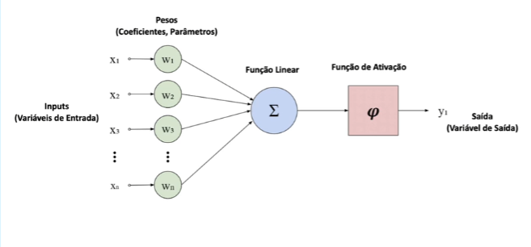

# MÓDULO 02:

## Fundamentos de Data Science e AI:

### Ciência de Dados:

É um campo interdisciplinar que utiliza métodos, processos e algoritmos para extrair conhecimento e insights a partir de dados estruturados e não estruturados.

Combina técnicas de estatísticas, aprendizado de máquina, análise de dados e programação para entender e resolver problemas complexos, auxiliando na tomada de decisão.

A ciência de dados tem como objetivo resovler problemas de negócio, o que pode ser aplicado para qualquer empresa de qualquer segmento.

### Áreas de conhecimento:

#### Matemática e estatística:

Técnicas e prodecimentos de cáculo, análise e operações

#### Ciência da Computação:

ferramentas usadas no processo de análise, tal como programação de computadores, armazenamento e processamento paralelo.

#### Áreas de negócio:

o objetivo da ciência de dados é resolver problemas de negócio e conhecer e dominar o negócio em si é fundamental para aplicar de maneira assertiva as decisões resultantes do processo de análise.

Portanto: a ciência de dados envolve o uso de métodos automatizados (ciência da computação) para analisar (matemática e estatística) enormes quantidades de dados afim de extrair conhecimento (áreas de negócio) a partir dos dados.

## Fundamentos de DS e AI:

### Dado e tomada de decisão:

O objetivo do cientista de dados é transformar DADOS em DECISÕES e posteriormentes transformar isso em AÇÃO.

## O Processo Data-Driven:

O trabalho do cientista de dados é auxiliar na tomada de decisão e RESOLVENDO PROBLEMAS. O intuito de uma empresa ao contratar um cientista de dados é RESOLVER UM PROBLEMA. Portanto é importante que se estude e conheça métodos e ferramentas mas é mais importante entender que se deve resolver problemas de negócio em uma empresa.

A ciência de dados não é sobre matemática ou estatística e programação, mas RESOLVER PROBLEMAS.

### Passos para tomada de decisão

#### Passo 01: O que aconteceu

Algum problema está acontecendo e precisa de uma solução. Com isso, aplicamos metodologia e ciência de dados sobre os dados brutos para responder a próxima questão:

#### Passo 02: Por que aconteceu?

Com a análise dos dados históricos e os brutos, respondemos a questão.

#### Acontecerá novamente?

Podemos usar os dados históricos aplicando Machine Learning para prever prováveis cenários

#### O que deve ser feito?

Nessa etapa a equipe deve se unir para que juntos tomem a decisão final

#### Decisão:

Após a análise dos dados, transformação em informação e conhecimento, tomamos a decisão. A partir dela, então, deve-se calcular qual será a ação necessária para sanar o problema.

É a união de todo o processo que agrega valor no trabalho do cientista de dados.

## Ética em ciência de dados:

### Responsabilidade e transparência 

Ciencistas de dados devem ser transparentes sobre os métodos e algoritmos utilizados, explicando como os dados são coletados e analisados
É importante DOCUMENTAR o processo de análise e justificar as decisões tomadas com base nos dados.

### Justiça e não discriminação:

Devem ser evitados veises nos dados e algoritmos que possam levar a decisões injutas ou discriminatórias.
A igualdade de oportunidades deve ser promovida, garantindo que os sistemas de IA e aprendizado de máquina não perpetuem desigualdades existentes.

### Consentimento Informado:

Os indivíduos devem ser informados sobre como seus dados serão usados e dar consentimento explícito para a coleta e utilização de seus dados.
O consentimento deve ser obtido de forma clara e compreensível, sem ambiguidade.
Se não há consentimento, OS DADOS NÃO PODEM SER USADOS.

### Beneficência e não maleficência:

Os cientistas de dados devem garantir que suas análises tragam benefícios e evitem causar danos aos indivíduos ou grupos envolvidos.
Devem ser considerados os impacitos sociais e éticos que as decisões tomadas podem causar.

## Privacidade em ciência de dados:

### Proteção de dados pessoais:

Devem ser proegidos contra acessos não autorizados, vazamentos e outros riscos de segurança.
Métodos de anonimização e pseudonimização podem ser utilizados para proteger a identidade dos indivíduos.

### Conformidade com regulações:

Cientistas de dados deevm estar cientes e cumprir as regulamentações de privacidade aplicáveis, como o Regulamento Geral de Proteção de Dados na Europa e LGDP no Brasil

### Minimização de Dados:

Não busque mais dados que precisa para o projeto.
Apenas os dados necessários para a análise devem ser coletados e armazenados.

### Direito dos titulares dos dados:

Os indivíduos têm o direito de acessar, corrigir e excluir seus dados pessoais.
Devem ser fornecidos meios fáceis para que os indivíduos exerçam esses direitos.

# MÓDULO 04:

## Implementação de Projetos de Ciência de Dados:

é a implementação de métodos estatísticos, algoritmos de aprendizado de máquina e técnicas analísticas para resolver problemas complexos e extrair insights valiosos dos dados.
Casa projeto tem suas particularidades, por isso, cada projeto tem a melhor forma de ser resolvido.

### 7 Etapas principais para implementar um projeto de ciência de dados:

1. Defninição do problema
2. Coleta e armazenamento de dados
3. Preparação e limpeza dos dados
4. Análise exploratória dos dados
5. Modelagem preditiva/estatística
6. Avaliação e transparentes
7. Entrega do resultado 

## 01. Definição do Problema:

Tudo começa com a definição do problema:

- entendimento do objetivo do negócio
- definição dos objetivos do projeto: 
> ex: a empresa quer criar um modelo capaz de prever a venda para três meses
- identificação das perguntas de pesquisa
- análise dos dados disponíveis
> é IMPERATIVO que existam dados a serem avaliados
- definição de métricas de sucesso
> aqui é estabelecido a definição de quando o projeto obteve sucesso
- planejamento do projeto
 
## 02. Coleta e armazenamento de dados:

Dados precisos e relevantes são a base para análises e insights de valor. Envolver as partes interessadas para definir os requisitos de dados é vital para o projeto.

Existem diversos métodos de coletas de dados (pesquisas, entrevistas, observações, sensores, registros de transação etc). A escolha do método depende do tipo de dado necessário e do contexto do projeto.

Garantir a qualidade dos dados é FUNDAMENTAL. Dados corrompidos podem levar a conclusões errôneas. Técnicas de limpeza e validação de dados ajudam a manter a integridade e precisão dos dados.

O armazenamento de dados deve ser eficiente e seguro. Banco de dados relacionais, banco de dados NoSQL, Data Lakes e Data Warehouse são algumas opções disponíveis.

Dados devem ser protegidos: implementar medidas de segurança, controle de acesso e políticas de privacidade ajudam a proteger os dados contra acessos não autorizados. 

Coleta e armazenamento de dados são normalmente responsabilidade do Engenheiro de Dados.

## 03. Preparação e limpeza dos dados:

Quando os dados são recebidos no mundo real, estão edsorganizados: valores ausentes, duplicados, extremos etc. Quase nunca os dados são recebidos de maneira completa.

A preparação de dados é o processo de transdformar os dados brutos em um formato adequado.

### Etapas:

1. Limpeza
2. Transformação
3. Integração/Combinação
4. Codificação
5. Redução

### Limpeza:

Envolve remoção de valores nulos, duplicados e inconsistentes. A normalização dos dados também são necessárias para garantir a consitência:
Ex:
> 'São Paulo', 'SP' e 'S. Paulo' correspondem à mesma cidade, mas estão escritas de forma diferente. É preciso que estejam padonizados para a análise.

### Transformação:

inclui a conversão de daos em formatos apropriados para análise. Isso pode envolver agregação, codificação e criação de novas variáveis. 

### Integração:

combina dados de diferentes fontes para fornecer uma visão unificada. Técnicas de ETL (extração,m transformação e carga) são frequentemente usadas para consolidar dados de sistemas diversos em um repositório central.

### Codificação:

é o processo de transformar variáveis do tipo texto em representação numérica. Modificamos os dados sem modificar a informação.
Ex:
> variável indicando se um cliente vai ou não fazer uma compra com valores Sim/Não; Codificamos para valores 1/0 a fim de treinar um modelo de ML.

### Redução de dimensionalidade:

simplifica conjuntos de dados grandes e complexos, mantendo as informações mais relevantes. Métodos como seleção de características e PCA (análise de componentes principais) ajudam a reduzir a complexidade e melhorar a eficiência da análise.

## 04. Análise exploratória dos dados (EDA):

é uma etapa crítica no fluxo de trabalho da ciência de dados.
Envolve a análise inicial dos dados para entender suas principais características, padrões e anomalias. É a analise de dados puramente dita. Serve para o cruzamento e análise de dados.
Aqui ocorrem análise de gráficos, aplicação de metodologias etc.

Esse processo utiliza técnicas estatísticas descritivas e ferramentas de visualização para resumiar as distribuições dos dados, identificar relações entre variáveis e detectar valores discrepantes.

A visualização de dados ajuda no entendimento do cenário e insights. A visualização auxilia a stakeholders não técnicos a entenderem o cenário.
Todas as decisões devem ser justificadas, portanto, usar os dados para justificar uma escolha de caminho é a melhor forma de convencer os superiores.

## 05. Metodologia Preditiva/Estatística:

Modelagens boas dependem de uma matéria prima boa. Não podemos 
negligenciar as etapas anteriores em detrimento desta.

Modelagem Preditiva e Modelagem Estatística são duas abordagens usadas em ciencia de dados, mas possuem diferentes objetivos e metodologias.

### Modelagem Estatística: 

Estamos interessados em analisar e explicar a relação entre as variáveis
Ex:
> o número de quartos de uma casa influencia em seu preço?

### Modelagem Preditiva:

Estamos interessados em usar as variáveis para fazer previsões.
Ex:
> qual será o preço de uma casa de acordo com seus quartos

Usamos modelagem estatistica como técnica de seleção de variáveis em modelagem preditiva.

### Principais diferanças:

#### Objetivo:

Modelagem Estatística:
- propósito: entender relações enter variáveis, identificar padrões e fazer inferências sobre populaçoes baseadas em amostras
- foco: estabelecer relações causais ou associativas, contruir modelos estatísticos

Modelagem Preditiva:
- propósito: prever valores futuros ou resultados baseados em dados históricos
- foco: otimiazr a precisão das previsões, muitas vezes sem se preocupar com a interpretabilidade do modelo

#### Abordagem:

Modelagem Estatística:
- métodos: usa técnicas como regressão linear, ANOVA, testes de hipóteses
- suposições: geralmente assume que os dados seguem certas distribuições eque há relações lineares entre variáveis

Modelagem Preditiva:
- métodos: inclui uma ampla gama de técnicas como aprendizado de máquina supervisionado, não supervisionado, etc
- suposições: cada algoritmo pode ter as suas próprias suposições que devem ser validadas. Foca mais na performance preditiva.

#### Interpretação: 

Modelagem Estatística:
- interpretação: resultados são interpretáveis e podem ser usados para inferir relações causais
- saída: coeficientes com significados claros, intervalos de confiança, valores p

Modelagem Preditiva:
- interpretação: pode ser mais difícil de interpretar, especialmente com modelos complexos como redes neurais.
- saída: foco na precisão das previsões, medidas de performance como AUC, precisão, recall etc.

#### Exemplos de uso:

Modelagem Estatística:
- usada para testar hipóteses
ex:
> efeito de um medicamento em uma doença
- análise de pesquisa de mercado para entender a relação entre variáveis demográficas e comportamento de compra.

Modelagem Preditiva:
- usada em negócios para prever vendas futuras, compra de clientes ou detecção de fraude
- aplicações em engenharia para prever falhas de máquinas ou manutenção preditiva.

#### Ferramentas e técnicas:

Modelagem Estatística:
- ferramentas: linguagem R, Stata, SAS, SPSS, linguagem Python
- técnicas: regressão linear, regressão logística, ANOVA, análise de sobrevivência, Métodos probabilísticos etc

Modelagem Preditiva:
- ferramentas: linguagem python (scikit-leanr, PyTorch, TensorFlow)
- Técnicas: árvores de decisão, floresta aleatória, redes neurais, deep learning, svm, boosting, bagging, regressão linear, regressão logística

## Avaliação e teste:

Etapa em que são realizados os testes e avaliações para averiguar se o modelo proposto está em pleno funcionamento e se atende os requisitos solicitados.

Precisamos avaliar e testar as soluções:

- métricas de avaliação
- validação cruzada
- overfitting e underfitting
> Overfitting é quando o modelo aprende "demais" sobre os dados. Ele aprende o detalhe do dado, o que é contra indicado já que buscamos sua generalização. Underfitting é quando não aprende o suficiente. Ocorre quando não há um padrão nos dados. O modelo de machine learning APRENDE padrões, não CRIA.
- curvas de aprendizado
- análise de erros
- benchmarking

# MÓDULO 09:

## Ciclo de vida de um projeto data science:

O ciclo de vida do projeto data science se dá no tempo da criação, desenvolvimento e conclusão dele.

Este ciclo envolve várias etapas críticas que ajudam a transformar dados em informações valiosas:

### Etapas do ciclo de vida:

## Definição do problema de negócio:

### Definição do problema e objetivos:

Esta fase envolve a identificação clara do problema a ser resolvido e a definição de objetivos específicos. é importante alinhar o problema com os objetivos estratégicos da empresa, garantindo que as soluções propostas sejam relevantes e viáveis.
É nessa fase que são definidos os objetivos finais e os critérios de finalização.

## Coleta e preparação dos dados:

Após a definição dos objetivos a coleta de dados é realizada em fontas internas e externas. A preparação dos dados inclui limpeza, tratamento de dados faltantes e transformação de dados apra formatos adequados para análise. Aqui pode envolver um Engenheiro de Dados. O trabalho inicial é de um CIENTISTA DE DADOS, o trabalho de EDA é de um ENGENHEIRO DE DADOS.

A coleta de dados e Identificação do problema estão ligados em um ciclo porque pode ser que, após a definição do problema inicial, não existam dados suficientes para realizar uma análise. Por isso pode ser que seja necessário voltar uma etapa e definir um novo problema ou esperar para que os dados necessários sejam coletados.

## Exploração e análise de dados:

Os problemas são resolvidos encontrando padrões nos dados. 

Nessa fase estamos buscando eventuais anomalias. Os dados são exporados usando técnicas estatísticas e de visualização para entender as tendências, padrões e anomalias. A análise exploratória de dados é fundamental para formular hipóteses e planos de modelagem.

Um ANALISTA DE DADOS trabalha até aqui. A partir daqui, um CIENTISTA DE DADOS toma a direção do projeto.

Nesta etapa também usamos bastante a visualização de dados, por isso é importante ter conhecimento sobre a criação dos gráficos, como qual usar em que situação e as ferramentas necessárias para criá-los.

## Modelagem preditiva/estatística:

Aqui é a fase onde são aplicados modelos estatísticos e de machine laerning. Eles são desenvolvidos e treinados usando os dados preparados. Diversar versões de um modelo podem ser criadas aplicando técnicas como otimizzação de hiperparâmetros e validação cruzzada, bem como podemos usar diferentes algorítmos.

Moedelos Estatísticos devem ser usado para entender relações entre os dados coletados. Modelos de Machine Learning devem ser usados para projetar possibilidades diferentes usando os dados coletados.

## Avaliação do Modelo:

é uma etapa crític para determinar a precisão e a eficácia do modelo em prever ou classificar dados. Se a avaliação do modelo demostrar que a performnce está ruim, pode ser necessário voltar e revisar o problema de negócio ou os dados disponíveis.

Aqui muitas métricas são postas para a avaliação. Caso haja conflitos entre métricas, é preciso voltar e rever o modelo. Às vezes é preciso voltar para a etapa de definição do problema de negócio. Em geral, com um grande volume de dados, as métricas tendem a ser positivas. 

Todas as decisões de projeto DEVEM SER JUSTIFICADAS. É possível que a decisão tomada tenha sido errada, nesse caso a melhor decisão é voltar e tomar a decisão correta.

## Implementação e deploy dos modelos:

Aqui os modelos são colocados em produção. Isso pode envolver a integração do modelo com sistemas de TI existentes e o deploy pode ser realizado em ambientes em cloud ou on-premise (rede local da empresa). Ou podemos executar o modelo e entregar o resultado da análise.

### Possíveis profissionais na etapa:
- analista de dados
- engenheiro de dados
- cientista de dados
- engenheiro de machine learning

dependendo do porte da empresa pode ter também um arquiteto de dados com a visão geral.

Normalmente durante a fase de definição do problema de negócios é também definido o entregável do projeto. Ciência de Dados não é sobre construção de softwares. Ciência de dados é sobre resolver problemas e geralmente não inclui a criação de um programa específico.

Em geral, as fases de um projeto típico de ciência de dados é:

## Comunicação de resultado e storytelling:

Após as etapas do processo em si, depois, é necessário usar as SOFT SKILLS para a comunicação do resultado.

Na comunicação do resultado é indicado utilizar técnicas de STORY TELLING.

## Produtos gerados em projetos de DS:

### Exemplos de produtos:

#### - Relatórios:

Relatórios com resultados das conclusões de um modelo estatistico.

#### - Gráficos e Dashboards:

Resultado de provisões representados em gráficos, por exemplo.

#### - Modelos Estatisticos e Preditivos:

Entrega do modelo em si. Depois disso a empresa usa o modelo dentro do seu pipeline no seu dia a dia.

#### - Apresentação com os Insights:

Sugestão de mudanças e caminhos a serem seguidos.

#### - Sistema de Recomendação ou Data App

# MÓDULO 10:

## Fundamento da IA:

A IA é o conjunto de técnicas para construção de sistemas a fim de reroduzir nas máquinas a capacidade cognitiva dos seres humanos.

Tudo se resume a MATEMÁTICA, desde o medelos mais simples aos mais complexos.

Usamos matemática através de algoritmos que são treinados a partir de dados. Esses algoritmos são executados no computador através de linguagens de programação.

Se esistir um padrão nos dados, um algoritmo será capa de aprender esse padrão gerando assim um modelo. Esse modelo pode ser usado com novos dados para resolver o problema para oqual ele foi criado. 

Uma IA NÃO CRIA PADRÕES, ela apenas identifica e reproduz. Portanto, caso não haja padrões reconhecíveis nos dados, não haverá modelos resultantes.

## IA x Machine Learning x Deep Learning x IA Generativa:

### IA:

Teoria geral que engloba o desenvolvimento de sistemas computacionais capazes de realizar tarefas cognitivas em nível humano.

### Machine learning:

algoritmos que aprendem a partir de padrões nos dados sem que sejam explicitamente programados. Seubconjunto da IA.

### Deep Learning:

subconjunto do machine learning, engloba algoritmos baseados em redes neurais artificiais com alta capacidade de aprendizado.

### IA Generativa:

ramo do deep learning focado na geração de imagem e texto.

## Principais categorias de IA:

Existem duas principais categorias de IA:

### IA Estreita (Narrow IA):

Qualquer modelo de IA existente hoje é um modelo de IA estreita.
Projetada para executar uma tarefa específica, como assistentes virtuais, reconhecimento facial, sistemas de recomendação, etc. Não possui consciência ouentendimento além de suas funções programadas.

### IA Geral (Artificial General Intelligence):

Ainda não foi desenvolvida. Uma IA teórica que teria a capacidade de entender, aprender e aplicar conhecimento de maneira geral, semelhante à inteligência humana. Exatamente como o cérebro humano.

IA Geral é uma IA onisciente. Ainda não há hardwares ou recursos de deep learning suficientes para alcançá-la.

## Técnicas comuns de IA:

### Machine Learning:

Subcampo da IA que utiliza algoritmos para aprender padrões a partir de dados e fazer previsões ou decisões sem ser explicitamente programado para cada tarefa.

### Deep Learning:

um tipo de machine learning que utiliza redes neurais artificiais com muitas camadas para modelar padrões complexos em grandes quantidades de dados.

### Aprendizado por reforço:

subcampo da IA onde um agente aprende a tomar decisões sequenciais interagindo com um ambiente. O agente recebe recompensas ou punições com base nas ações que executa e seu objetivo é maximizar a recompensa total ao longo do tempo. Amplamente aplicado em áreas como robótica, jogos, controle de sistemas e robôs de investimento.

# MÓDULO 11:

## Deep Learning, dados e GPU:

### Tempestade perfeita:

União de elementos que nos trouxeram até onde estamos na IA:

- Deep Learning (arquitetura de transformadores - arq mais recente de deep learning)
- Dados em abundância
- GPU - maior capacidade de cálculo 
- Programação - une todos os elementos anteriores

### Programação de computadores em IA:

programar em IA vai além de usar uma linguagem de script. Envolve a criação de sistemas que podem aprender e tomar decisões de maneira autônoma. Isso inclui o desenvolvimento de linguagem natural e outras técnicas avançadas.

A programação de IA utiliza linguagem como Python, R, Rust, C++, Scala ou Java, e frameworks como TensorFlow, PyTorch e Scikit-leanr, mas também requer um entendimento profundo de matemáica, estatística e lógica.

Implica em lidar com um grande volume de dados, pré processamento, treinamento de modelos, avaliação e otimização contínua para melhorar a precisão e a eficiência dos sistemas de IA.

## Algoritmos e Heurísticas:

Algoritmos são um conjunto de regras que especificam uma sequência de operações a serem realizadas para resolver um problema ou executar uma tarefa. Eles são precisos, detalhados e garantem uma solução específica se seguidos corretamente. Por exemplo, algoritmos podem ser usados para ordenar listas etc.

Eurísticas são abordagens práticas e informais para resolver problemas que não garantem uma solução exata, mas que são rápidas e eficientes para encontrar soluções satisfatórias ou aproximadas. Elas são especialmente úteis em situações compelxas ou onde uma solução exata é impraticável ou impossível de obter. Heurísticas são baseados em experiência, intuição e regras gerais, como dividir e conquistar' e são frequentemente usados em IA e otimização.

Muitos algoritmos e heurísticas já estão prontos para serem usados em frameworks como TensorFlow ou PyTorch. Desenvolvê-los é um trabalho árduo e requer muita experimentação.

## Algoritmo de IA:

Duas partes:

- Foward Propagation: é a passada para frente de uma rede neural artificial. Aqui ocorre a previsão.
- Backward Propagation: é a passada de volta. Aqui ocorre o aprendizado do modelo e atualização dos pesos. O backward propagation é baseado no cálculo da derivada. 

## IA e aprendizado de máquina:

Enquanto a IA pode incluir abordagens que não aprendem dados, o Aprendiado de Máquina se baseia na ideia de que os sistemas podem melhorar seu desempenho automaticamente através da experiência.

## Dicas para uma vaga de dados e IA:

### 1. Portfolio de projetos:

Construção de portfolio de dados e IA

### 2. Desenvolver habilidade de comunicação

# MÓDULO 12:

## Tipos de Aprendizado de Máquina:

## Supervisionado:

O algoritmo é treinado com um conjunto de dados rotulados, ou seja, onde tanto a saída quanto a entrada são conhecidas. O objetivo é aprender uma função que mapeie entradas e saídas, de forma a fazer previsões precisas para novos dados. Exemplos incluem regressão linear e classificadores de árvore de decisão. é o mais amplamente usado no machine learning.

Há dois tipos de modelo supervisionado: classificação e regressão. Se eu quiser prever um número, uso regressão. Se quiser prever uma classe, uso classificação.

### Supervisionado - Regressão:

é uma técnica de aprendizado supervisionado utilizada para prever um valor contínuo. O objetivo é modelar a relação entre uma variável dependendente (y) e uma ou mais variáveis independentes (x). exemplos comunds incluem prever preços de casas com base em características como tamanho, localização, etc. ou prever a temperatura com base em addos históricos.

### Supervisionado - classificação:

Utilizada para prever uma categoria ou clsse para os dados. O objetivo é mapear as entradas para uma ou mais categorias discretas. Exemplos incluem a classificação de emails como spam ou não spam. O modelo busca encontrar um padrão e, caso haja, é criado um modelo de predição.

## Não Supervisionado:

Usado quando só temos os dados de entrada. O algoritmo é treinado com dados que não possuem rótulos, ou seja, não possuem saída. O objetivo é identificar padrões ou estruturas ocultas nos dados, como agrupamentos ou reduções de dimensionalidade. 

Podemos usar o não supervisionado para rotular os dados de saída e aplicá-los em um modelo supervisionado. Dessa forma temos como resultado um modelo preditivo.

### Clusterização:

Agrupa dados de forma que os itens dentro do mesmo grupo (ou cluster) sejam mais semelhantes entre si do que aos de outros grupos. 

O objetivo é identificar e separar padrões ou estrutura nos dados. Um exemplo comum é o algotimo k-mins, que particiona o conjunto de dados em k clusters, com cada ponto de dados atribuído ao cluster com o centróide mais próximo. É amplamente usada em segmentação de mercado, análise de comportamento do cliente e detecção de anomalias.

## Por reforço:

Envolve treinar um agente para tomar decisões sequenciais, onde ele recebe recompensas ou punições com base nas ações que realizza em um ambiente. O objetivo é aprender uma política que maximize a recompensa ao longo do tempo. 
De acordo com a ação do programa mudamos o valor de uma variável (positivo para recompensa e negativo para punição).

## Pipeline de Machine Learning:

## Deploy e Implementação de modelos em produção:

Existem várias abordagens para deploy e implementação de modelos de Machine Learning em proudção, cada uma adequada a diferentes cenários e necessidades. Aqui estão alguns exemplos.

Hoje, na maioria dos casos, as empresas usam API: o modelo recebe dados e os transforma para devolver o produto. 

## Operacionalização do Aprendizado de Máquina (MLOps):

Para chegar no ponto de pensar em MLOps a empresa já deve ter alguma experiência com machine learning.

A operacionalização do aprendizado de máquina é uma prática que combina Machine Learning com DevOps (desenvolvimento e operações) para automatizar, monitorar e gerenciar o ciclo de vida dos modelos de machine learning de forma eficiente e escalável.

O MLOps abrange todas as fases de vida do modelo, desde sua concepção até a implementação.

Os principais componentes do MLOps incluem:

- desenvolvimento de treinamento de modelos
- continuous integration 
- continuous deployment
- gestão de dados
- automação de pipeline de ML
- governança e compliance
- colaboração e reprodutibilidade

# MÓDULO 13:

## Fundamentos de Redes Neurais Artificiais:

Há várias formas de construir sistemas de IA, mas uma estratégia é a que normalmente apresenta ótimos resultados e está presente nos principais sistemas de IA são as redes neurais artificiais.

Redes Neurais são modelos computacionais inspirados no cérebro humano, projetados para reconhecer padrões e aprender com os dados. Elas são compostas por unidades chamadas NEURÔNIOS ARTIFICIAIS, que se organizam em camadas: camada de entrada, camadas ocultas e camada de saída.

Quanto mais camadas ocultas, mais profundo é o modelo, exatamente o nome 'deep learning'

Neurônio matemático:

O resultado do treinamento é um conjunto de pesos ou parâmetros, que representam a relação entre dados de entrada e saída.

Quando iniciamos o treinamento não sabemos os valores dos pesos e por isso buscamos dados históricos de entrada e saída. Inicializamos os pesos com valores aleatórios com base em uma estratégia de inicialização e treinamos o modelo para que aprenda os melhores valores de pesos.

Por isso TREINAMENTO DE IA ESTÁ ABSOLUTAMENTE RELACIONADO À CIÊNCIA DE DADOS. Para que o modelo seja alimentado da melhor maneira possível é imperativo que existam dados formatados e tratados.

O modelo aprende o padrão dos dados (se existirem) e encontram os valores dos pesos. Tudo isso é uma aproximação matemática e nunca saberemos os valores exatos. O que estamos buscando é o conjunto de pesos que melhor explica a relação entre dados de entrada e saída. Tudo se resume à aproximação matemática. Quanto mais preciso o modelo mais exata será a saída de dados.

## Deep Learning e a Revolução da IA:

e uma subárea do aprendiado de máquina e utiliza redes neurais artificiais, inspiradas na estrutura e funcionamento do cérebro humano, para processar e interpretar grandes quantidades de dados. Para usar deep learning é preciso uma GRANDE quantidade de dadosl, por isso, para usar deep learning é preciso que a empresa tenha adotado uma política de dados substancial.

Essas redes neurais são compostas por várias camadas de neurônios artificiais, que são interconectados e organiados em uma hierarquia, permitindo que o modelo aprenda representações cada vez mais complexas dos dados.

A grande evolução do deep learning aconteceu por três fatores principais:

1. Aumento da capacidade de processamento: o avanço das GPUs e posteriormente TPUs (unidade de processamento tensor)

2. Disponibilidade de grande volume de dados: a explosão da internet, mídias sociais e dispositivos resultou em uma abundância de dados, que são essenciais para o treinamento de modelos de Deep Learning.

3. Avanço em algoritmos e arquiteturas: novas arquiteturas de redes neurais, como redes convolucionais (CNN) para Visão COMPUTACIONAL E REDES RECORRENTES (rnn) para dados sequenciais, foram desenvolvidas, assim como técnicas de regularização, otimiação e inicialização de parâmetros que tornaram o treinamento de redes profundas mais eficiente e estável.

## Tranferência de aprendizado (Tranfer Learning):

A transferência de aprendizado é uma técnica em aprendizado de máquina, particularmente popular em Deep Learning, onde um modelo treinado em uma tarfe é reutiliazdo como ponto de partida para outra tarefa relacionada.

Isso é especialmente útil quando se tem um conjunto de dados limitado para a nova tarefa, mas um modelo robusta já foi treinado em um grande conjunto de dados. 

Em suma, caso não haja um grande volume de dados (mandatório para deep learning), alguns frameworks disponibilizam modelos pré treinados onde o único passo necessário é ajustar para que ele caiba dentro dos dados disponíveis para uso.

No caso acima, o modelo base é capaz de reconhecer vários meios de transporte, mas não conhecia avião. Podemos usá-lo para, com o ajuste fine (fine tuning), ele possa classificar também aviões.

## Arquitetura de Transformadores:

Uma arquitetura relativamente recente e avançada que, diferente do CNN e RNN recebe dados grandes (como textos grandes) e interpreta de maneira mais eficiente. 

A inovação mais significativa do Tranformer é a utilização de antenção muitocabeças (multi-head attention), que permite ao modelo focar em diferentes partes da sequência simultaneamente, capturando múltiplos aspectos das dependências entre palavras. Ou seja, existem múltiplas operações matemáticas simultaneamente.

Os transformers são altamente paralelizáveis, o que os torna mais eficientes em termos de treinamento em comparação com RNNs e LSTMs (Long Short-Term Memory)

Isso, combinado com seu desempenho superior em diversas tarefas, levou ao seu rápido domínio em PLN. Desde a introduçãp do Transformer, diversas variantes e modelos baseados nessa arquitetura foram desenvolvidos, incluindo BERT, GPT e T5, usados em uma ampla gama de aplicações de PLN e a base para diversos outros modelos.

Além de PLN, os Transformers também estão sendo aplicados com sucesso em outras áreas, cmo Visão Computacional, onde modelos como o Vision Transfromer (ViT) mostraram resultados promissores, bem como na análise de séries temporais como o Temporal Fusion Transformer (TFT).

## Large Language Models (LLM):

São modelos de IA generativa capaz de formar textos e imagens a nível humano. O modelo GPT e o Copilot são exemplos de aplicações que a usam.

Sçao modelos de linguagem baseados em Deep Learning que possuem um grande número de parâmetros, geralmente na ordem bilhões ou ate trilhões, o que lhes permite compreender e gerar texto com alto grau de coerência e relevância.

Esses modelos são treinados em grandes volumes de dados textuais, abrangendo uma ampla variedade de temas, estilos e contextos, permitindo que se tornem extremamente versáteis em tarefas de Processamento de Linguagem Natural.

A aquitetura de LLM é algo geralmente baseada no modelo Transformer, introduzido pelo artgigo 'attention is all you need'. Esse modelo utiliza mecanismos de atenção apra processar o texto de forma não sequencial, permitindo que o modelo capte dependências de longo alcance entre palavras ou frases.

## Tratamendo de Fine Tuning:

Os LLMs funcionam da seguinte forma:

- pré treinamento: o modelo é treinado em um grande corpus de texto, que pode incluir livros, artigos, sites e outros conteúdos textuais. Durante essa fase, o modelo aprende a prever a próxima palavra em uma frase ou a preencher palavras ausentes, internalizando padrões gramaticais, semânticos e contextuais. O pré-treinamento é feito de forma não supervisionada, utilizando grandes quantidades de dados disponíveis.

- Fine tuning: Após o pré treinamento, o modelo pode ser ajustado em um conjunto de dados específicos para tarefas mais focadas, como tradução eutomáica, resumo de texto, geração de código, ou classificação de sentimentos. Este ajuste é feito de forma supervisionada, com exemplos específicos para a tarefa.

- Geração de texto e outras tarefas: uma vez treinado, o LLM pode ser usado para gerar texto coerente com base em um prompt dado, responder perguntas, traduzir idiomas ou realizar outras tarefas de PLN. Devido ao seu tamanho e complexidade, esses modelos são capazes de entender e gerar texto em um nível muito próximo ao humano.

## Retrieval Augumented Generation (RAG) e GraphRAG:

Conceito mais avançado dentro do universo da IA. As empresas estão cada vez mais buscando profissionais que implementem sistemas RAG. 

Assim como quqalquer modelo de aprendizado de máquina, o LLM tem como conhecimento aquilo que estava presenta nos dados de treino. Isso foi o que ele aprender. Logo, o LLM fica limitado a esse conhecimento.

Mas como usar a capacidade de geração de texto do LLM para, por exemplo, gerar texto a partir de conteúdo interno de uma empresa, como documentos, contratos, notas fiscais, planilhas e banco de dados?

Precisamos dar ao LLM esse contexto. E como podemos fazer isso? Dando acesso a um banco de dados externo.

RAG, ou emportuguês RECUPERAÇÃO DE GERAÇÃO AUMENTADA, é uma técnica que combina geração de linguagem, como os Large Language Models (LLMs), com sistemas de recuperação de informações, para melhorar a qualidade e a relevância das respostas geradas pelo modelo.

Essa abordagem é particularmente útil em situações onde o modelo precisa acessar informações externas ou contextos específicos que não foram completamente capturados durante o treinamento.

GraphRAG é uma extensão da técnica RAG que incorpora elementos de grafos para melhorar ainda mais a qualidade e a contextualização das respostas geradas por modelos de linguagem.

Em vez de depender exclusivamente de documentos textuais ou bases de dados tradicionais para recuperação de informações, o GraphRAG utiliza estruturas de rgafos para organizar, relacionar e acessar informações de maneira mais eficientes e estruturada.

FUNCIONAMENTO DO RAG:

Tudo inicia no usuário. O usuário gera uma 'query', ou seja, uma pesquisa. Essa pesquisa vai para um DATABASE VETORIAL, que foi previamente alimentado com documentação indexidada. Após isso, pega o resultado da busca vetorial e constrói o prompt (que está no sistema). O prompt tem a pergunta do usuário e o resultado da busca vetorial, que é então enviado para o LLM. Ou seja, o LLM recebe a pergunta e a 'resposta', gera a resposta e então entrega ao usuário.

## Diferença entre IA x Machine Learning x Deep Learning x LLM:

